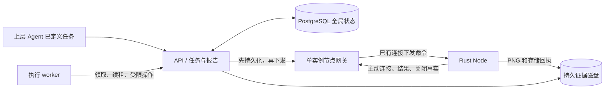

# 架构与职责

## 流程

项目位置与节点内部结构统一维护在 [Browser Node 结构图](browser-node-architecture/README.md)。图中展示目标数据流和当前实现状态；控制面、Rust 节点和可配置模型执行 Agent 已接通，范围见 [测试入口与覆盖边界](../tests/README.md)。

## 上层 Agent

定义验证环境、访问目标、验收标准和预算。可以自行分析需求、代码或 Issue，但这些工作不属于 ProofRun。本仓库不包含 Spec Runtime。

平台验证输入是否完整、环境是否可用，并报告不满足的前提。执行过程中不能自行降低或新增验收标准；定义不足时返回明确的阻塞信息，由上层修正任务。

## 控制面：apps/api

拥有任务状态、路由、全局队列、节点注册、容量预留、租约、取消、超时、证据元数据和最终报告。数据库是持久状态来源；在线连接不能替代持久状态。

节点通过主动连接建立下行命令通道，保持内网部署能力。连接中断、凭据撤销、租约过期和浏览器关闭分别建模。

控制面同一时刻只运行一个活动 Fastify 实例，PostgreSQL 同时保存任务队列、容量预留、执行租约、待投递命令和入站去重记录。实例锁阻止第二个活动 API；启用 HA 时备用实例等待接管，依赖共享数据库和证据目录。DOM 证据存数据库，PNG 存持久磁盘；不另建 Redis 或任务总线。具体接口和状态转移见 [API 说明](../apps/api/README.md)。

worker 的短租约不能由节点心跳续期；节点授权不能超过 worker 剩余权限。任务结束立即禁止新动作，但直到确认关闭才释放浏览器容量。未确认命令只用原身份重送，未知副作用停止本次执行。

## 验证执行 Agent：apps/agent

领取已定义的验证任务；根据页面状态选择操作；显式等待业务结果；收集证据；逐条评价验收标准。模型配置、上下文裁剪和浏览器工具映射放在这里。当前采用直接 Chat Completions 适配、有界工具循环和独立租约守护，无额外 Agent 框架。

执行 Agent 不拥有全局调度和最终任务状态。基础设施故障、业务失败和证据不足应分别报告。结构化错误和已完成操作记录用于恢复，不能通过无条件重试隐藏未知写入。

## Console：apps/console

以控制面为唯一事实来源，提供任务提交/查询/取消、节点状态与容量查询、逐项报告和证据预览。读取结构来自共享 Schema；浏览器端只使用生成类型，不引入包含文件读取的服务端校验模块。上层任务以已定义 JSON 提交，Console 不运行需求分析。

访问凭据验证成功后保存在当前站点的浏览器 localStorage，再次打开或断开连接后自动填入，连接页可清除本地记录；同源请求携带 Authorization。当前页面串行轮询，切换页面时取消旧读取；写入不自动重试。证据按同源 ID 读取、核对摘要并以图片或纯文本展示，任务终态与浏览器清理进度独立呈现。

## Rust 节点：crates/browser-node

管理本机容量、会话、profile、进程、运行时截止时间与关闭确认；建立到控制面的主动连接；将有限的浏览器协议请求转换成 agent-browser 调用；采集和交付执行证据。

引擎 daemon 常驻，会话内命令按顺序执行；不同会话的并发由节点准入控制。终止 CLI 子进程不等于终止浏览器，会话关闭必须覆盖真正拥有浏览器的 daemon 和进程范围。

Rust 节点不运行需求分析，不生成验收标准，也不取代验证执行 Agent。

首版使用一个二进制的主服务 / 内部 session-host 两种运行模式，由 Linux systemd 为每个会话管理独立进程范围。本地 SQLite 只记录恢复与结果重送所需状态。设计见 [Browser Node 架构与技术选型](browser-node-design.md)，实际支持范围见 [节点说明](../crates/browser-node/README.md)。

## 协议与证据

- `VerificationTask`：上层已定义的目标和标准；当前 0.1 草案接入任务准入。
- `VerificationReport`：执行状态、产品 verdict、逐项结果与证据引用。
- NodeCommand / NodeEvent：心跳、租约、会话操作、结果、关闭确认和证据可用事件。配对、领取和执行 HTTP 写入使用 ControlRequest。
- 浏览器 refs 等短期句柄绑定会话和观察版本，不得作为长期业务实体 ID。
- JSON Schema 校验负责结构；租约归属、验收覆盖、证据存在及关联、报告聚合属于领域校验。

终态报告不能把基础设施错误标记成产品 FAILED，也不能只凭 CLI 返回成功就宣布验收 PASSED。

## 部署

初期一个仓库，API、Agent、Console、Rust 节点可独立部署。控制面和 Agent 所在网络不需要直接访问业务内网；浏览器节点需要访问业务系统及控制面。

远端节点的凭据、登录状态和浏览器数据留在节点。已实现登录快照、人工控制权交接、证据交付、凭据轮换和停机维护；细节与边界见 [部署与运行维护](../deploy/README.md)。网络限制仍由部署环境提供，真实模型和内网 VM 的生产验收尚未完成。
