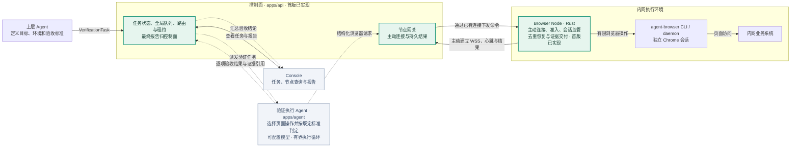
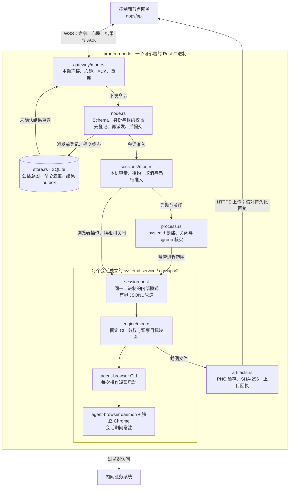

# Browser Node 结构图

本文件集中维护 Browser Node 在 ProofRun 中的位置及其内部结构。图中的箭头表示目标数据流；标注的实现状态以当前代码为准。节点、最小控制面和执行 Agent 已接通；模型服务与型号可配置，Console 已接入任务、节点查询与报告证据。

## 在项目中的位置

Browser Node 只返回浏览器操作事实与证据，不定义验收标准，也不把操作成功判定为业务验收通过。控制面拥有全局任务状态和最终报告；执行 Agent 负责页面决策与逐项验收。

## Browser Node 内部结构

同一会话内只执行一个浏览器操作，续租和关闭可绕过操作队列。CLI 退出不等于浏览器关闭；只有核实原 systemd 进程范围已清空或消失，节点才释放容量。命令在派发前写入 SQLite，重启后未提交的结果报告为 `UNKNOWN`，不重放浏览器动作。截图在存储回执核对并提交后才标记为可用并删除本地文件。

写动作当前默认关闭。节点层的命令去重不能证明 agent-browser 在“业务已提交但响应丢失”时不会内部重试；真实控制面联调已通过；真实 Linux Chrome 和内网 VM 仍待验收。
