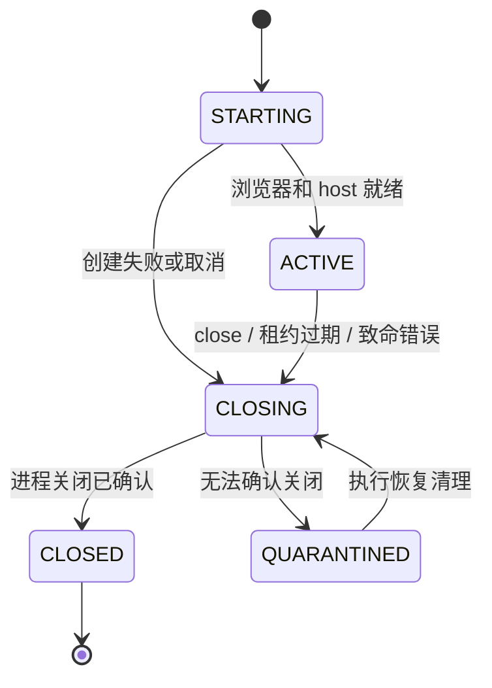

# Browser Node 架构设计

状态：首版节点实现已落地，目标架构中的部分能力仍待验收。2026-09-23。实际接口与限制以 [节点说明](../crates/browser-node/README.md)、[协议](node-protocol.md) 和 [验证记录](browser-node-validation.md) 为准。

目标是提供容易部署、容易定位故障、可以可靠回收的远端浏览器执行节点。Spec 定义、模型决策和业务验收判定属于上层与执行 Agent；Browser Node 只执行有授权、有期限的浏览器操作并返回事实和证据。

## 1. 首版决策

1. 一个 Cargo crate、一个可部署二进制 `proofrun-node`。
2. 一个常驻主服务，主动通过 WSS 连接控制面；节点不开放业务 HTTP 监听端口。
3. 一场浏览器会话对应一个内部 `session-host` 进程、一个 agent-browser session、一组独立 Chrome 进程。
4. 首个生产目标限定为 Linux VM + systemd + cgroup v2；macOS 用于开发与适配验证。
5. 控制面保留全局队列；节点只做本机容量准入，会话内一次只执行一个浏览器操作。
6. agent-browser 使用固定版本的原生 CLI，通过明确参数调用；保持 daemon 常驻。
7. 一个本地 SQLite 文件保存恢复所需的少量记录，截图等大文件存文件系统。
8. 首版重启后关闭旧会话、上报结果，不恢复正在执行的浏览器动作。

这些是架构决策，不能用 doctor 的依赖探测代替完整验收。当前已实现会话监管、传输、命令账本、截图链路及一次性配对，并与真实控制面完成夹具联调；引擎丢响应验证和真实 VM 验收尚未完成。

## 2. 运行结构

运行结构图统一维护在 [Browser Node 结构图](browser-node-architecture/README.md)。

部署时只有一个 ProofRun 服务需要安装和升级。`session-host` 由主服务自动创建，是同一版本二进制的内部子命令，不独立发布、不访问控制面、不持有节点凭据。

### 为什么每个会话增加一个 session-host

普通 CLI 调用退出后，浏览器仍然可能由后台 daemon 持有。终止调用方、关闭 socket 或杀掉一个 PID，都不能证明浏览器已经关闭。

让同一个会话的所有 CLI 调用都从同一个 host 进程发起，可以让后来新建的 daemon 仍落在同一个 systemd 进程范围。host 只负责串行执行、读取取消/期限信号和交付文件；业务状态归主服务管理。

这是用一个很小的本地进程边界，换取明确的关闭范围。单会话故障可以只关闭该会话，其他会话继续运行。代价是多一层本地管道，以及 Linux 生产环境对 systemd 的依赖。

agent-browser 官方说明其命名 session 可以持有独立浏览器和状态；共享一个外部 CDP 浏览器时隔离语义不同。因此首版只支持节点自行启动的独立 Chrome，不接管用户已有浏览器。[官方会话说明](https://agent-browser.dev/sessions)

## 3. 职责与状态归属

| 对象                         | 唯一负责人             | 其他组件的行为                   |
| ---------------------------- | ---------------------- | -------------------------------- |
| 任务定义、验收标准           | 上层 Agent             | Node 不接收完整 Spec，不修改定义 |
| 全局队列、节点选择、执行租约 | 控制面                 | Node 校验分配并执行本机准入      |
| 页面操作选择、业务判定       | 验证执行 Agent         | Node 返回页面事实和执行结果      |
| 本机容量、会话登记、结果重送 | Node 主服务            | host 不另建业务状态数据库        |
| CLI 调用及会话内动作顺序     | session-host           | 同一会话不并发操作页面           |
| 会话进程关闭                 | Node 的 systemd 适配层 | 不以 CLI 退出代替进程关闭确认    |
| 最终验收报告                 | 控制面                 | Node 只交付命令结果与证据元数据  |

Node 返回 `operationStatus: SUCCEEDED` 只表示浏览器操作完成，不能表示某个验收项通过。

## 4. 技术框架

| 范围           | 建议                                           | 使用方式                                        |
| -------------- | ---------------------------------------------- | ----------------------------------------------- |
| 异步运行       | Tokio                                          | 网络、管道、定时器、子进程；保持一套运行时      |
| 取消与任务退出 | tokio-util / CancellationToken + Tokio JoinSet | 显式通知、等待退出，不依赖丢弃 Future 清理进程  |
| 控制通道       | tokio-tungstenite + rustls                     | 一个主动建立的 WSS 连接；JSON 消息              |
| 证据上传、配对 | reqwest + rustls                               | HTTPS 客户端，流式传输；首版经 API 中转存储     |
| 协议           | serde / serde_json + JSON Schema               | 外部消息使用带明确 type 的封闭枚举              |
| Rust 类型生成  | typify，构建期使用                             | 从 contracts/schemas 生成，不维护重复手写协议   |
| 本地记录       | rusqlite，bundled SQLite                       | 专用线程独占连接，短事务；不引入连接池与 ORM    |
| 命令与配置     | clap + 一个 TOML 配置文件                      | 显式字段和少量环境变量覆盖，凭据单独保存        |
| 错误与诊断     | thiserror、tracing、tracing-subscriber         | 类型化错误，结构化日志；启动层可用 anyhow       |
| 进程监管       | systemd transient service + cgroup v2          | Type=exec、KillMode=control-group，明确关闭超时 |

依赖在对应模块实现时加入并由 Cargo.lock 固定。本次设计不修改 Cargo.toml，也不提前引入整套依赖。

Node 初期不需要 Web 服务框架、gRPC、Redis 客户端、S3 SDK、Actor 框架或自研 CDP。Tokio 有界 channel 和普通结构体足够表达这些职责。

选择依据：Tokio 提供异步进程接口，但 Child 被丢弃默认不会终止进程；`kill_on_drop` 也不能替代对完整会话的监管和显式 wait。[Tokio 进程文档](https://docs.rs/tokio/latest/tokio/process/struct.Command.html) WSS 客户端可以直接使用 [tokio-tungstenite](https://docs.rs/tokio-tungstenite/latest/tokio_tungstenite/)。[typify](https://docs.rs/typify/latest/typify/) 支持从 JSON Schema 生成 Rust 类型，但生成类型仍需配合输入约束和领域校验。

## 5. 代码组织

保持现有一个 crate，逐步补入以下文件。目录表示目标结构，不要求先创建空实现。

```text
crates/browser-node/src/
  main.rs                子命令分发、启动与退出
  config.rs              配置读取和启动检查
  node.rs                组装组件、主服务生命周期
  protocol.rs            同源生成的协议入口
  error.rs               稳定的节点错误分类

  gateway/
    mod.rs               WSS 连接、心跳、重连、消息收发

  sessions/
    mod.rs               容量、session 注册表、租约和命令准入
    host.rs              内部 session-host 模式及串行执行

  engine/
    mod.rs               当前具体 AgentBrowserEngine
    cli.rs               参数构造、超时、输出边界、返回解析
    observation.rs       页面事实和临时 refs 的规范化
    wait.rs              有限的业务就绪条件及 Shadow DOM 适配

  process.rs             创建 / 查询 / 停止会话 systemd unit
  store.rs               SQLite 事务与恢复查询
  artifacts.rs           文件落盘、hash、上传与回收
```

业务上只有 gateway、sessions、engine、store、artifacts 五块，process 是 Linux 适配边界。`node.rs` 负责装配，不承载页面操作逻辑。

先使用具体结构体和明确的方法，不为每一层建立 trait、repository 或 service 包装。引擎测试可以使用可控的假 CLI 可执行程序；确有第二个引擎或其他真实需求时再抽象公共接口。

## 6. 并发与排队

### 两层准入，一处全局队列

控制面根据节点上报的容量选择节点。节点在真正创建会话时再次原子检查本机占用，满额直接返回 `NODE_BUSY`。控制面保留任务并重新调度，Node 不维护第二套待执行任务队列。

一个 session 从 STARTING 到确认 CLOSED 始终占用一个 slot。CLOSING 和 QUARANTINED 也占用 slot，不能从活着的 Rust task 数量推断剩余容量。

### 会话内只允许一个正在执行的浏览器命令

- 前一个命令的结果被持久化后，才接受下一个浏览器命令；并发提交返回 `SESSION_BUSY`。
- `renew`、`close` 和关闭期限走独立控制路径，不能排在长时间 `wait` 后面。
- host 的输入读取与命令执行分开，等待过程中仍能收到 close 和期限更新。
- 不同 session 按节点配置的容量并发；SQLite 线程和上传任务均有有界队列。
- 网络输出阻塞不能阻塞租约到期与关闭处理；日志、心跳可合并，终态结果需要可靠重送。

首版一个会话只对应一个受控页面流。多页支持可以后续增加明确的 pageId，不开放共享外部 CDP 会话来节省资源。

## 7. 最小外部协议

Node 接收 Session 与 Browser Operation，不接收整个 VerificationTask，也不理解验收标准。控制面将 task/attempt 关联到 session，执行 Agent 分解具体操作。

### 六类执行命令

| 命令              | 意义                                                    |
| ----------------- | ------------------------------------------------------- |
| `session.open`    | 分配一个会话，绑定环境、租约、预算和本机配置引用        |
| `session.renew`   | 在旧租约仍有效时续租，不恢复已经过期的会话              |
| `browser.observe` | 返回页面信息及按需采集的 DOM、截图或网络证据            |
| `browser.act`     | navigate、click、fill、select、press、scroll 等有限操作 |
| `browser.wait`    | 等待明确的元素、文本、URL 或受支持的页面状态条件        |
| `session.close`   | 撤销执行权限，终止当前操作并关闭整个会话                |

注册、心跳、节点排空、消息 ACK 和重连状态同步属于控制消息。它们不进入浏览器动作队列。初期不单独提供“取消命令后继续同一会话”的语义；取消执行直接关闭该会话。

执行命令信封至少包含以下字段，具体 schema 在实现网关前定稿：

```text
protocolVersion
commandId
nodeId + nodeEpoch
sessionId
leaseId + fence
timeoutMs
type + payload
```

`nodeId` 是安装身份，`nodeEpoch` 每次主服务启动更新；sessionId 不复用。网络连接重建不更换 nodeEpoch。租约 grant 单独携带明确的有效期限和受控环境信息。

结果应区分：

- `operationStatus`：SUCCEEDED / FAILED / CANCELLED / TIMED_OUT / UNKNOWN。
- `effect`：NOT_STARTED / COMPLETED / MAY_HAVE_HAPPENED。
- `error.code`：稳定的错误分类，不依赖人类可读字符串控制重试。
- `observation`、`artifactRefs`：有会话和命令归属的事实与证据。

同一个 commandId 必须绑定同一会话、租约和规范化 payload hash；重复请求返回已有结果或进行中状态，内容不符则拒绝。过期身份不能靠重送 commandId 绕过鉴权。

租约过期后的回收使用控制面当前有效的节点级清理授权，严格匹配原会话和进程身份，不要求旧会话重新获得操作权限。

### refs 和观察版本

将引擎短期 ref 包装在 `sessionId + observationId` 的语境中；过期引用明确返回 `STALE_OBSERVATION`。发生导航或新的观察后按适配器规则更新引用，不把 CLI 原始对象直接当成公共协议。

观察包含采集起止时间和页面版本线索。DOM 和截图由多次引擎调用获得时，不宣称原子一致；检测到页面变化时标记不稳定，交给执行 Agent 决定重新观察。

## 8. 一条命令如何执行

1. Gateway 校验消息类型、大小、节点身份和当前连接授权。
2. Sessions 校验 session、租约、fence、截止时间、并发状态和操作能力。
3. Store 查询 commandId；已有终态则重送，已有 DISPATCHED 则不重复派发。
4. 在事务中持久化 `DISPATCHED` 与 payload hash。提交成功以后才把命令交给 host。
5. Host 再检查截止时间，通过 Engine 构造固定的 argv 调用 CLI；不经过 shell。
6. Engine 有界读取 stdout/stderr，归一化结果和需要保留的证据。
7. Store 保存终态结果并加入 outbox；随后返回控制面。
8. 控制面持久接收后 ACK，Node 标记已交付；只重送结果，不重放动作。

`DISPATCHED` 表示“从此可能已执行”，不是承诺浏览器一定开始。若在第 4、5 步之间崩溃，会产生保守的 UNKNOWN；相比重放一次可能已经发生的业务写入，这个取舍更容易理解和核查。

命令被拒绝且尚未派发时可以明确返回 NOT_STARTED。click、navigate、fill 等操作都可能触发业务请求，不能仅因命令名不是 submit 就认定没有副作用。

数据库写入失败时停止接收新操作，撤销内存中的执行许可并关闭受影响会话。不能因为 CLOSING 暂时无法落盘而跳过物理清理；恢复阶段再根据已登记的创建意图核实状态。

### agent-browser 内部重试是上线前必须核实的条件

外层 commandId 去重不能消除引擎内部重发。本次查阅的上游提交 `d01253d9db28d75080e36da3c1c31ef89454731e` 中，`send_command` 对 EOF、连接重置等错误会再次发送请求。该代码审查不等同于已证明 npm 0.38.1 发布二进制的完整行为，也不证明业务重复写入已经发生。[上游 connection.rs](https://github.com/vercel-labs/agent-browser/blob/d01253d9db28d75080e36da3c1c31ef89454731e/cli/src/connection.rs#L949)

因此，写动作上线前需要固定发行物与对应源码，并用“服务端已提交、返回链路丢失”的故障注入验证。若不能关闭发送后的隐式重试，优先向上游增加一次发送模式，必要时携带一个可审计的小补丁；不因此重写浏览器驱动。此条件未满足时，不承诺业务 exactly-once，也不把写动作列为生产就绪能力。

## 9. 会话状态、期限与关闭



忙闲由当前 in-flight command 表达，不再增加一套 BUSY 会话状态。CLOSING 不允许回到 ACTIVE。

### 租约与断连

心跳证明节点在线，租约授予操作权限，两者分开。断连后停止接收新操作，已派发操作只能在剩余租约和命令期限内完成。收到关闭、到期或发现 host 异常时进入 CLOSING。

续租响应必须关联节点发出的续租请求；期限采用保守计算，不能在迟到响应到达时重新起算一整段 TTL。Linux 主服务与 host 使用同一主机单调时钟期限，排队时间计入预算。过期后迟到的续租不复活会话。

最终生效期限是命令期限、会话硬期限和租约期限三者的最小值。host 独立监控该期限；stdin EOF 表示主管连接丢失，立即进入关闭。管道读取、关闭处理不得等待某条 CLI 命令自然结束。

### 关闭顺序

1. 撤销本地操作许可，持久化 CLOSING；拒绝后续浏览器操作。
2. 若引擎仍响应，短时间尝试正常 close。
3. 停止绑定该会话的 systemd unit；经过有限宽限期后强制终止剩余进程。
4. 核实 unit 身份、停止结果和对应 cgroup 内无存活进程，记录关闭事实。
5. 在事务中写入 CLOSED 和待交付关闭结果；随后释放本机 slot。

控制面收到关闭结果后再释放对应的全局容量。业务未知写入导致的账号或数据占用由控制面另行处理，不能因浏览器关闭而直接判定业务已经回滚。

`systemctl stop` 成功、daemon PID 文件消失或扫描结果为空，都不能单独作为完整关闭证据；需要核对创建时登记的 unit/cgroup/主机身份。无法核实则保持 QUARANTINED，占用不释放。

systemd 的 `KillMode=control-group` 提供停止整个 unit 进程范围的机制，本方案在其上增加会话归属和关闭记录。[官方进程关闭说明](https://github.com/systemd/systemd/blob/main/man/systemd.kill.xml)

## 10. systemd 集成保持很薄

主服务通过固定参数的 `systemd-run --user --pipe` 创建 transient service，运行同一二进制的 `session-host`。stdout 专用于有大小限制的 JSONL，stderr 用于结构化诊断。业务参数在启动后的管道内发送，不拼接到 systemd 命令行。

创建时固定 Type=exec、KillMode=control-group、Restart=no、有限的 TimeoutStopSec 和会话硬 RuntimeMaxSec。所有浏览器 CLI 都由该 host 发起，不从主服务直接启动。初始化时登记随机且不复用的 unit 名、系统 boot ID 和实际 cgroup 路径。

启动前先持久化创建意图和 unit 名，收到 host ready 后再登记实际状态，防止“浏览器已经启动、数据库没有记录”的窗口。创建中断时用该意图执行恢复清理。

服务单元不自动重启 session-host；丢失页面状态后应结束本次会话。主服务可由 systemd 自动重启，但必须完成恢复扫描再接收任务。

Node 运行在专用 OS 用户下，安装时配置可持续工作的用户 systemd manager。doctor 实际验证 transient service、cgroup 查询和关闭能力；不满足时不能对外声明生产就绪。cgroup 是资源与生命周期边界，不等同于不同租户间的完整安全沙箱。

`--pipe` 支持继承标准输入输出，Type=exec 能使启动结果更准确地反映程序是否真正执行；生产适配需要在目标 Linux 发行版验证这些行为。[systemd-run 官方说明](https://github.com/systemd/systemd/blob/main/man/systemd-run.xml)

## 11. 本地持久化

```text
node-home/
  node.toml
  credential.json
  node.db
  sessions/<sessionId>/
  artifacts/<artifactId>
```

node-home 每个安装实例独占。启动先获取 OS 级进程锁，避免两个主服务同时管理同一个状态目录。凭据只保留在主服务，host 使用明确裁剪后的环境；浏览器配置、socket 目录和 session 名均隔离于用户个人配置。

数据库只保存四类记录：

| 表        | 内容                                           |
| --------- | ---------------------------------------------- |
| sessions  | session、租约、占用、unit 身份、状态与关闭事实 |
| commands  | commandId、payload hash、派发状态和终态结果    |
| artifacts | 本地文件身份、归属、hash、上传状态与存储确认   |
| outbox    | 需要可靠交付的结果、关闭事件和 ACK 状态        |

大文件不进入数据库。SQLite 使用 WAL + synchronous=FULL，单个专用线程独占连接，通过有界 channel 执行短事务；网络和浏览器调用不在事务内等待。这选择了实现简单和关键记录持久化，实际磁盘延迟需要测量。[SQLite 持久化说明](https://www.sqlite.org/pragma.html#pragma_synchronous)、[rusqlite](https://docs.rs/rusqlite/latest/rusqlite/)

不保存可自动回放的业务命令流水，也不从日志重建状态机。commandId 的去重记录和关闭记录在控制面确认终态并超过约定的重送窗口后才能删除；会话 ID 不复用。过期、未知或已清理的旧会话请求明确拒绝，不能隐式创建新浏览器。

### 重启恢复

1. 独占状态目录，加载本机身份并创建新的 nodeEpoch。
2. 查找数据库未关闭记录与本安装命名空间内的残留 unit，处理创建意图与实际进程的不一致。
3. 撤销旧执行授权，关闭旧会话，不恢复旧页面执行。
4. 未记录终态的 DISPATCHED 命令记为 UNKNOWN，保留“可能已写入”的事实。
5. 核实进程关闭后恢复容量，重送已经持久化的结果与证据状态。

本机身份不匹配、数据库损坏或关闭状态不可核实时，节点保持未就绪并返回可操作的恢复原因；不能通过清空目录自动解除占用。

## 12. 证据与效率

Node 采集证据，执行 Agent 判断证据是否足够，控制面生成最终报告。

- 根据 observe 请求选择 DOM、截图、网络片段；动作反馈与显式验收观察分开。
- screenshot 等先写临时文件，完成后计算 hash、同步并原子归档，再登记 metadata。
- 文件引用关联 sessionId、commandId、observationId、采集时间和内容 hash。
- 小结果通过 WSS 返回，大文件经 reqwest 流式上传 API；避免图片占满控制通道。
- 初期走 API 证据入口，内网节点只需能访问控制面；以后确有需要再增加直传对象存储。
- 上传重试使用稳定 artifactId 和 hash，由 API 去重；只有存储确认后才标为 AVAILABLE。
- 本地磁盘和上传并发有明确上限。达到阈值时停止接收需要新增证据的操作，保留关闭能力；不悄悄丢失验收证据。
- 浏览器确认关闭后可释放 slot，证据上传继续由主服务完成。报告缺少必要证据时不能宣称通过。

性能优化顺序：浏览器会话复用 → 小型观察结果 → 按需截图 → 有限的只读批量读取。原 POC 的 batch 测量只证明本地调用成本可能下降，不证明整体任务更快。首版不增加多步写动作 batch，避免复杂的部分成功和重放语义。

## 13. 最小功能范围

首个可验收版本包含：配对/注册、主动连接、节点池与容量、租约、临时 profile、单会话串行浏览器操作、明确条件等待、DOM/截图证据、结果重送、取消、超时与重启清理。

持久登录、人工接管、多页面流程、视频、完整网络证据按场景逐项加入。这些能力通过能力清单显式声明；执行 Agent 请求未实现能力时返回 UNSUPPORTED，不静默降级。

内网访问由节点部署位置和节点池路由保证。需要限制浏览器访问范围的环境，应由部署侧出站网关/代理实施，并覆盖重定向、子资源和 WebSocket；仅检查导航 URL 不足以实现网络策略。首版不在 Node 内重新开发通用代理服务，受限环境要在投用前验证实际出站约束。

## 14. 实施与验收顺序

| 阶段          | 交付                                   | 必须看到的结果                                                               |
| ------------- | -------------------------------------- | ---------------------------------------------------------------------------- |
| A：关闭边界   | session-host + systemd 适配 + 固定 CLI | Linux 上两会话并存；强制关闭一个不会影响另一个；主服务被 kill 后旧会话可清理 |
| B：命令可靠性 | SQLite + commandId + 截止时间 + 恢复   | 回包丢失只重送结果；写入结果未知不会盲目重做；关闭失败不释放容量             |
| C：远端接入   | WSS 注册、租约、能力、控制面路由       | 仅出站连接的内网 VM 能接收并执行任务；断连、迟到续租和旧命令被正确处理       |
| D：证据闭环   | observe、artifact spool、上传、关联    | 上层取得可核查的证据；上传中断可恢复；截图与动作成功不被混同为业务通过       |

阶段 A 同时核实引擎内部重试语义。不要在关闭与写入边界不明确时先铺开所有浏览器命令。

测试重点是外部可见行为：服务端提交次数、真实进程存活、租约是否仍授权、证据能否读取。Linux 集成测试为生产依据，macOS 上的 CLI 和类型检查不代替这些验收。

建议记录五组指标：会话启动/关闭耗时、命令耗时、证据上传耗时、占用/隔离中的 slot、UNKNOWN 与恢复失败次数。先使用 tracing 日志和心跳摘要，不为首版额外搭建完整可观测性子系统。
