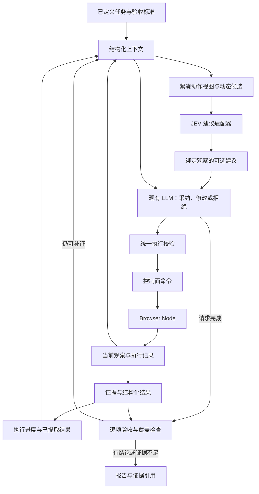

# JEV 策略边界与建议模式设计

本文保留建议审核与影子策略的目标设计；当前已经实现 `llm` 和 `jev` 混合策略，运行行为见 [并行对比](parallel-comparison.md)。`jev_shadow`、`jev_advisory` 等候选策略尚未提供配置入口。

## 1. 结论与边界

建议审核模式可将 JEV 设计成可选的动作建议提供者：根据当前观察给出现有动作候选中的选择，现有大模型可以采纳、修改或拒绝。最终操作仍经过 ProofRun 执行器、控制面和 Browser Node。

这里的“参考模式”有两层含义：借鉴参考项目的动态候选决策机制；运行时把 JEV 的输出作为建议。JEV 本身也是模型服务，接入它不等于消除模型决策。

任务目标和验收标准继续由上层定义。执行 Agent 可以拆解执行步骤、维护进度，但不能改写标准。文字生成、跨页面结果整理、证据语义核验仍需独立承担，不能由“选择了 DONE”替代。

## 2. 参考项目实际做了什么

它把下一步拆成“选操作”和“选目标”，只提供当前页面支持的候选。在一次请求中同时询问不同操作的目标，随后只使用所选操作对应的答案。填写文字时另用文本模型生成值；建议中包含候选概率和置信度。其 TypeSafe 接口与 Chat Completions 不同，ProofRun 在 `model/jev.ts` 中独立适配。[模型实现](https://github.com/browser-use/jev-ultrafast/blob/main/jev_ultrafast/model.py)

循环会检查观察是否过期，执行前消费决定，并在操作后重新读取页面之前记录已完成的操作。它的 `plan` 实际初始化为完整目标组成的单项列表，因此不能把这个字段理解成已经实现了复杂的任务规划器。[循环实现](https://github.com/browser-use/jev-ultrafast/blob/main/jev_ultrafast/agent.py)

参考浏览器层还检查目标状态与遮挡。其快照读取器覆盖常见 HTML/ARIA 控件，但并不完整支持 Shadow DOM、iframe 等复杂页面。适合借鉴采集与校验机制，不能直接覆盖 ProofRun 的全部浏览器能力。[浏览器实现](https://github.com/browser-use/jev-ultrafast/blob/main/jev_ultrafast/browser.py)、[快照实现](https://github.com/browser-use/jev-ultrafast/blob/main/jev_ultrafast/snapshot.js)

## 3. 与当前 ProofRun 的对应关系

| 关注点   | 当前实现                                                    | 建议审核模式的设计方向                       |
| -------- | ----------------------------------------------------------- | -------------------------------------------- |
| 模型边界 | `DecisionModel.decide` 返回封闭决定，按任务选择 llm/jev     | 增加无执行权限的建议提供者                   |
| Context  | `execution/context.ts` 组织任务、预算、观察、历史和覆盖标记 | 适配器接收类型化视图，减少隐含 JSON 字段依赖 |
| 元素描述 | 状态、操作能力、原生选项、区域及覆盖缺口                    | 与按范围读取/补全协议结合                    |
| 动作执行 | 当前观察目标校验及 Node 派发前命中检查                      | 建议携带来源，采纳时再次核实                 |
| 完成判断 | 公共工作流门槛、标准覆盖与证据引用校验                      | 独立核验业务语义与跨页面覆盖                 |
| 调用计量 | 每次实际供应商请求按用途记录与扣预算                        | 分析建议采纳、修改、拒绝及回退成本           |

代码入口：

- [模型接口与现有适配器](../apps/agent/src/model/chat.ts)
- [上下文组织](../apps/agent/src/execution/context.ts)与[执行循环和完成校验](../apps/agent/src/execution/runner.ts)
- [观察结构](../apps/agent/src/evidence/observation.ts)
- [节点浏览器引擎](../crates/browser-node/src/engine/mod.rs)
- [封闭决策协议](../contracts/schemas/agent-decision.schema.json)

现有 `observationId` 表明目标来自哪次观察，不足以独自证明模型返回时页面中的目标仍保持原状态。新鲜度检查必须在实际输入之前由 Node 完成，填写值生成或人工接管之后也不能直接复用旧建议。

## 4. 推荐架构：JEV 提建议，LLM 保留决策权

JEV 不持有浏览器执行权限，不直接调用 Node，也不负责领取任务、续租、人工交接或写最终报告。继续复用现有受限执行链，避免出现第二套任务状态和重试机制。

### 可选策略

`llm` 为现有基线，现有 `jev` 对应混合执行；其余为提议名称，尚无配置入口。

| 模式           | JEV 输出去向                         | 最终动作决策者 | 用途                      |
| -------------- | ------------------------------------ | -------------- | ------------------------- |
| `llm`          | 不调用                               | 现有 LLM       | 默认基线                  |
| `jev_shadow`   | 仅记录，不进入决策上下文             | 现有 LLM       | 比较建议与执行结果        |
| `jev_advisory` | 作为本轮可选建议交给 LLM             | 现有 LLM       | 可选的建议审核模式        |
| `hybrid`       | 仅在明确支持的范围直接形成待校验动作 | JEV 或回退 LLM | 现有 `jev` 的混合执行方向 |

`jev_advisory` 一般增加一次网络请求；LLM 仍需决策，因此不能承诺降低延迟或 token。只有改变上下文构造和调用路由，才可能实现相关收益。`jev_shadow` 也会产生额外调用和用量，不能算作免费观测。

## 5. Context 与建议契约

先让执行器生成有类型的 `DecisionContext`，再由不同适配器序列化。避免让 JEV 适配器反复解析现有 `text` 字符串并依赖隐含字段。

### 三种按职责组织的视图

1. **动作视图**：原始目标与相关约束、当前子目标、URL、标题、相关页面片段、当前候选、字段状态、近期操作、剩余预算、截断标记。用于 JEV 判断下一步。
2. **整理视图**：提取出的结果、栏目或分页覆盖记录、每条记录的来源和证据引用。用于跨页面归并，减少重复传入长页面文本。
3. **验收视图**：完整且未改写的验收标准、完整覆盖记录，以及按需读取的实际证据。用于核验，不能仅根据动作摘要或模型自己的总结通过任务。

完整证据继续保存在证据层；紧凑视图只服务决策。视图中无法容纳的内容应明确标记，并允许补充观察或读取证据，不能把未出现理解为不存在。

### 建议应携带的字段

| 字段                                      | 约束                                                    |
| ----------------------------------------- | ------------------------------------------------------- |
| `observationId`                           | 只对本轮观察有效；换页、重新观察或人工接管后失效        |
| `candidateSetId`                          | 标识该观察派生的候选集合，防止编号跨集合复用            |
| `operation`、`candidateId`                | 必须来自能力过滤后的有限候选；由执行器映射到当前 target |
| `operationConfidence`、`targetConfidence` | 仅作策略参考，分别记录，不能当作验收通过概率            |
| `provider`、`model`、`latencyMs`、`usage` | 用于评估与预算；未知计费不能填成零成本                  |

建议状态需区分 `available / unavailable / stale / unsupported`。LLM 的采纳情况可在内部记录为 `accepted / modified / rejected`，不必一开始扩展公开的浏览器执行协议。现有输出不要求自由文本推理，不能为了显示“理由”伪造 JEV 未返回的解释。

LLM 继续看到任务、当前观察和必要证据，建议放在单独的辅助字段中，不提升为系统指令。其置信度不能覆盖页面事实，也不能覆盖任务标准。

## 6. 动作兼容性与失败处理

- 首期只开放已有协议能表达、且目标能力已确认的候选。不要仅凭元素名称推断它可以填写或选择。
- 当前协议支持原生 `select`，JEV 将候选选项映射为该动作；自定义下拉仍须点击、观察并选择真实目标。
- 参考项目的短暂停顿不能直接映射到当前要求 `selector + text` 的 `browser.wait`。等待条件仍由明确规则或 LLM 提供，并消耗原预算。
- 填写内容可以继续由现有 LLM 给出，不必为了模仿参考实现再新增一个文本服务。若后续拆分，生成文字后的执行前检查仍必须保留。
- JEV 不可用、输出不合法或不支持当前页面时，可在剩余预算内回到 LLM。所有实际模型请求都必须计入总调用预算，包括回退、重试和文本生成。
- 页面变更且尚未执行操作时，丢弃建议，重新观察和决策；重试次数有界。
- 已可能执行的浏览器动作不能因为模型回退而重新发送；继续遵循当前未知副作用停止规则。
- 多轮没有进展时触发重规划或阻塞，不能仅无限切换模型。页面指纹变化也不能直接当成业务有进展。
- JEV 的完成建议只触发验收步骤。验收证据缺失且仍可获取时补证；无法确认时使用 `INCONCLUSIVE`，不能直接映射成 `PASSED`。
- 原子 DOM 读取和目标检查若需要脚本，应由 Node 提供固定实现，不向模型开放任意脚本执行能力。

## 7. 用 GLM 价格整理任务验证设计

该任务同时需要交互选择、信息提取和完整性判断，适合检查职责拆分是否正确。

| 步骤                                 | 建议承担者          | 需要留下的事实                                           |
| ------------------------------------ | ------------------- | -------------------------------------------------------- |
| 识别页面栏目与遍历范围               | LLM 与覆盖记录      | 从页面实际发现的栏目、分页、待检查项                     |
| 选择栏目、筛选框、展开按钮和滚动动作 | JEV 建议 + LLM 审核 | 候选、采纳结果、动作后实际状态                           |
| 整理 GLM 价格条目                    | 提取逻辑或 LLM      | 模型、计费维度、单位、币种、价格、栏目、证据引用         |
| 跨栏目归并                           | 结果存储与 LLM      | 去重依据；不同计费模式不能合并成同一价格                 |
| 验证“整个页面”范围                   | 独立验收步骤        | 各栏目的访问记录、相关展开内容、分页或滚动边界、未覆盖项 |

“当前列表里所有 GLM 都提取完了”不能证明“整个页面所有相关栏目均已检查”。新策略必须显式保留覆盖进度。视口内动作视图可以很小，但完整性判断必须依赖跨步骤记录和实际证据。

独立验收不等于再问同一份摘要一次。优先检查可确定的覆盖与字段规则，并读取对应证据；需要语义模型时给它原始标准和证据，同时保留无法证明的部分。

## 8. 实施顺序与验收

1. 提取类型化 Context 与策略接口，保持 `llm` 行为；补充分用途调用计量。
2. 用录制观察检验候选契约，再在受控任务运行 `jev_shadow`；影子建议无执行权限。
3. 开启可选 `jev_advisory`，记录采纳、修正、拒绝以及最终实际效果。建议与 LLM 一致不能当作正确性标签。
4. 补充能力丰富的观察与执行前检查；对覆盖清晰的交互任务评估 `hybrid`。
5. 独立验收、结果归并和覆盖检查作为验证质量改进推进，不与“已经接入 JEV”混为一项完成度。

评估应固定同一任务、浏览器初始状态、执行链和预算，交替重复各策略，记录全部尝试：

- 实际完成率、误判通过率、完整性遗漏率；
- 过期建议、错误目标、重复操作和未知副作用；
- 决策耗时与完整任务耗时的中位数、较高分位；
- 各模型的调用、token、可获得的真实费用以及回退率。

夹具用于候选失效、控件状态和失败路径的可重复检验；真实网站用于实际页面与业务结果验证。不能把夹具通过写成真实环境验收。

参考项目公布的 25% 提速来自同一任务、相同模型下的三组运行时比较；其视频计时不含浏览器启动、初始导航和独立事后验收。这不能用来预测 ProofRun 更换策略后的速度或可靠性。[性能报告](https://github.com/browser-use/jev-ultrafast/blob/main/docs/performance.md)

策略收益需通过相同任务的配对测量验证，设计本身不提供性能结论。JEV 运行需要服务端 TypeSafe 配置及可达性，密钥不应放入 Console 的访问凭据输入框。
