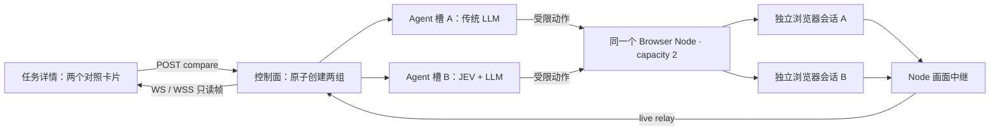

# JEV / LLM 并行对比

## 使用

打开任一任务详情，点击「并行对比 JEV / LLM」。控制面在同一事务中复制两份任务，保留目标、验收标准、环境和预算，刷新创建时间及截止时间；原任务与原报告保留。新详情页同时展示两组：

- 对照组 A：传统 LLM 决定动作、填写内容和验收。
- 实验组 B：真实 TypeSafe JEV 从当前页面候选中选择动作；输入文字和最终验收仍使用同一个 LLM。它是 JEV + LLM 混合策略，不是纯 JEV。

两组有独立执行租约、浏览器会话和报告，可由同一 worker 的不同并发槽执行。重复请求相同 comparisonId 不会重复创建。自动与显式 `environment.auth` 登录槽均支持对比：两组从同轮次的不可变初始快照创建独立会话，一组中途登录不会即时改变另一组。不要对不可重复的业务写入直接创建对比任务；浏览器隔离不等于目标系统数据隔离。此对比入口属于内部实验功能，不进入公开 [Case API](public-api.md)。

## 启动配置

在现有启动环境 `.proofrun/local.env` 中配置以下项，并按 README 原流程启动数据库、API、Node、Agent、Console。密钥只留在本机忽略文件中，不放入 `VITE_*`。

```sh
export PROOFRUN_AGENT_CONCURRENCY=2
# 100 次动作的混合策略还会调用填写与纠偏模型，独立限制总请求。
export PROOFRUN_AGENT_MAX_TURNS=200
export TYPESAFE_API_KEY='填写自己的 TypeSafe 密钥'
export TYPESAFE_MODEL=jev-latest
# 仍需原有 PROOFRUN_MODEL_BASE_URL、PROOFRUN_MODEL_API_KEY、PROOFRUN_MODEL。
pnpm dev:agent
```

Node 配置 `node.toml` 的顶层 `capacity = 2`，且节点须具备 `liveView` 能力。修改后重启 Node。Agent 槽数允许 1–8，默认 1；实际并行量受可用 Node 容量约束。两组按普通调度领取，不保证在同一毫秒开始，也不保留两个槽等待成组启动。

Console HTTP 开发模式：

```sh
pnpm dev:console
```

Console HTTPS / WSS 开发模式（证书必须包含对应主机并被浏览器信任）：

```sh
export PROOFRUN_TLS_CERT=/absolute/path/localhost.crt
export PROOFRUN_TLS_KEY=/absolute/path/localhost.key
pnpm --filter @proofrun/console exec vite --host 127.0.0.1 --port 5443 --strictPort
```

访问 `https://127.0.0.1:5443` 时自动使用 WSS，访问 HTTP 时使用 WS。生产环境应在同源 HTTPS 反向代理上支持 WebSocket upgrade；Node 与控制面跨主机连接同样应配置 WSS。本次本地 Docker 内部链路仍为 WS，5443 是 Console 客户端到开发代理的 TLS 入口。

## 架构与权限



- `POST /v1/tasks/:id/compare`：管理员认证，body 为 `{ "comparisonId": "自定义唯一标识", "maxActions": 100 }`。可选 maxActions 为 1–1000 的整数；省略则沿用原预算，两组使用相同覆盖值，原任务保持不可变。同一 comparisonId 的预算也不可更改。
- `GET /v1/tasks/:id/comparison`：返回同组的两份任务详情。
- `/v1/live/connect`：管理员凭据在 WebSocket 第一条消息认证，不出现在 URL。消息为 `{ "type": "authenticate", "executionId": "执行 ID", "token": "管理员凭据" }`。
- `/v1/live/relay`：现有节点凭据认证，并校验 streamId、节点身份和代次。Node 继续校验 session、lease 和 fence。
- 观看不切换到 HUMAN，不暂停 Agent，不接受鼠标键盘命令。人工接管或执行结束时关闭自动观看通道。
- 同一执行的观看者共享一条 Node 流，慢连接丢帧而不积压队列。状态约 750ms 更新，任务详情约 5 秒刷新。
- 最后一帧仅为内存预览缓存，最多 16 个执行、30 分钟，API 重启后清空。它不作为验收证据；正式证据仍由原有证据链维护。

## JEV 决策边界

JEV 使用任务相关正文片段、近期动作、剩余预算、错误反馈和有来源的跨栏目历史。当前页按相关性选择最多 14,000 字符，优先控件及任务相关链接，最多 80 个目标；整体请求上限 32,000 字符。历史最多保留 8 个不同页面状态，各自最多 16,000 字符并保留 artifactRefs；发送给 JEV 时进一步压缩或减少历史，并显式标记裁剪。

TypeSafe 在真实测试中拒绝完整长页，返回 max_tokens_exceeded。因此 JEV 的紧凑视图不代表完整验收证据；LLM 纠偏仍能读取执行器提供的完整当前上下文和有界历史。操作与目标合并为一次联合选择，避免未选操作也输出目标概率。

连续两次正文无变化、反复返回同一状态、每 6 轮新观察或剩余动作不超过 3 次时，自动请求 LLM 检查进度；JEV 也可主动选择 VERIFY / REPLAN。元素临时编号变化不算新内容。LLM 可继续操作或按原标准报告 INCONCLUSIVE，不会由规则自动判通过。真实纠偏会记录 jev.review 日志，所有子请求仍计入模型预算。
支持点击、填写、上下滚动、重新观察与请求 LLM 验收。填写先由 JEV 选择目标，再由 LLM 生成输入文字；验收阶段 LLM 可按原协议继续行动。尚未为拖拽等全部浏览器能力定义专用 JEV 分类。所有真实子请求均计入模型调用预算；token 只记录供应商返回的用量，不能由此推断未返回用量的失败请求费用。

## 真实验证记录（2026-09-27）

复用此前成功的普通表单任务 `real-model-smoke-675c0260`：输入 Ada-ProofRun，提交普通表单一次，验证成功文本，不操作 Shadow 表单。使用真实 Chromium、现有 Node、真实 TypeSafe JEV 与 `openai/gpt-5.6-sol`。

| 轮次                                           | 传统 LLM                | JEV + LLM                                 | 结果                                                                   |
| ---------------------------------------------- | ----------------------- | ----------------------------------------- | ---------------------------------------------------------------------- |
| `parallel-63fa3e11`                            | 52.647s；3 请求；3 动作 | 19.890s；5 请求；3 动作                   | 两组 PASSED；同一 Node 两个 ACTIVE 会话有重叠；WSS 收到 10 / 8 帧      |
| `compare-f98048ed-6220-4920-85c9-86ba3aeee9a2` | 19.601s；3 请求；3 动作 | 124.208s；6 请求（4 JEV + 2 LLM）；3 动作 | 从 Console 按钮发起；两组 PASSED；页面收到 13 / 156 帧，结束后保留画面 |

第二轮后服务端写入记录由 3 条增至 5 条，新增记录均为普通表单；两组会话均 CLOSED 且 closure_verified=true。缓存接口分别返回两组末帧。本机原始结果保存在忽略目录 `.proofrun/parallel/`。

两轮的速度排序相反，不能推断性能优势；需更多同任务配对样本和请求耗时分析。第二轮比第一轮多一次 JEV 请求，当前报告未保存每次请求延迟和错误，不能据此确定慢请求原因。

WSS 客户端使用显式信任的本地 CA 证书完成真实连接。内置浏览器拒绝当前自签名证书（ERR_CERT_AUTHORITY_INVALID），因此 UI 验收通过 HTTP / WS 完成；在浏览器中观看 WSS 前仍需用户配置可信证书。

自动回归：Agent 25 项、Console 客户端 4 项、API 集成测试 17 项通过，合同生成一致性与全应用类型检查通过。API 集成测试使用模拟 Node 验证成对创建、会话隔离、双流、认证和只读约束，不替代以上真实浏览器验证。

### Novita 长页面回归与故障修复

源任务为 `novita-glm-pricing-bfb1f1c8`，保留原始 20 分钟 / 40 次动作预算。

首次 `novita-compare-f4926623` 两组均因 ENGINE_FAILED 结束：JEV 组首次导航等待页面 load 超时，尚未调用模型；LLM 组第 7 次动作目标被固定栏或浮层遮挡。Node 的持久命令结果保存了原始引擎错误，这不是 WSS 连接失败。

针对固定版本 agent-browser 0.38.1 增加两个窄范围处理：

- 导航明确返回 load 超时后，用固定只读表达式核实 URL 仍为原请求地址且 document.readyState 为 interactive / complete。满足时进入正常观察，不重复导航、不声称页面动态内容已经全部加载；其他超时或核实失败仍按效果未知处理。
- 引擎在点击派发前明确返回遮挡错误时标记 TARGET_OBSCURED / NOT_STARTED。Agent 重新观察并把原因交给模型规划，连续三次遮挡停止。其他点击错误仍不可自动重试。

固定版本源码依据：[导航等待](https://github.com/vercel-labs/agent-browser/blob/aff6125c023b810ea3f2e5deec5379e9a4270bdc/cli/src/native/browser.rs)、[点击遮挡检查](https://github.com/vercel-labs/agent-browser/blob/aff6125c023b810ea3f2e5deec5379e9a4270bdc/cli/src/native/element.rs)。

修复后 `novita-compare-5bae0558` 两组有 ACTIVE 重叠，未再出现浏览器命令错误，两会话最终均确认关闭：

| 分组      | 耗时     | 动作 / 模型请求 | 结果                               | WSS 帧 |
| --------- | -------- | --------------- | ---------------------------------- | ------ |
| 传统 LLM  | 147.866s | 4 / 5           | 生成价格报告，模型自报 PASSED      | 28     |
| JEV + LLM | 305.477s | 40 / 50         | ACTION_BUDGET_EXCEEDED，未完成验收 | 145    |

LLM 报告仍声明了其他顶层栏目及 More 详情页的覆盖缺口，因此模型自报 PASSED 不代表独立人工确认全站完整。JEV 此轮耗尽动作预算属于决策与长页面上下文效果问题，不能将本轮写成双组验收通过。新增 Node 错误分类/导航核实测试 2 项、Agent 遮挡恢复与有界退出测试 2 项通过（Agent 总计 27 项）；这些单元夹具不替代真实网站验收。

### 100 动作与 JEV 使用修复

按用户要求，新一轮通过 `maxActions:100` 同时覆盖两组预算；历史任务的 40 次预算未改写。当前本机 Agent 请求上限为 200，两组时限仍为 20 分钟。从新任务再次创建对比会沿用其 100 次预算。

增加了相关正文检索、最多 8 个页面状态的证据记忆、重复状态检查、定期与低预算 LLM 纠偏、操作与目标的联合候选，并按任务相关性优先保留控件。修复后的首轮 `novita-compare-fcf64f71` 暴露 TypeSafe 对完整长页返回 HTTP 400 / max_tokens_exceeded，因此最终版本限制整体 JEV 请求为 32,000 字符，相关正文最多 14,000 字符。固定页面实测请求 27,962 字符返回 HTTP 200；若供应商仍拒绝上下文长度，明确交给原文本模型审查，不放宽浏览器权限。

最终真实运行 `novita-compare-70a4efa1`：

| 分组      | 动作上限 | 实际动作 | 模型请求            | 耗时     | 结果                                                               |
| --------- | -------- | -------- | ------------------- | -------- | ------------------------------------------------------------------ |
| JEV + LLM | 100      | 5        | 10（6 JEV + 4 LLM） | 150.183s | COMPLETED / INCONCLUSIVE；生成 12 项价格表，明确筛选与详情覆盖缺口 |
| 传统 LLM  | 100      | 1        | 0                   | 31.207s  | 首次导航超时，未进入模型决策；无法用于本轮速度对比                 |

日志记录 JEV 主动请求 3 次 REPLAN：LLM 两次返回后续动作，一次返回 verification.finish。两会话均确认关闭，JEV 画面收到 34 帧。本轮没有复现此前耗尽 40 次动作的循环，但单次成功收尾不能证明所有长页面问题已解决。

新增回归覆盖两万字符之后的相关正文、总请求大小、重复内容纠偏、低预算交接、历史检索、服务上下文限制与鉴权错误分离、失败请求已返回用量不丢失。Agent 总计 33 项、API 集成 17 项通过。历史报告不可变；后续新报告的 token 总计会包含格式校验失败前已返回的用量，与模型分项保持一致。
