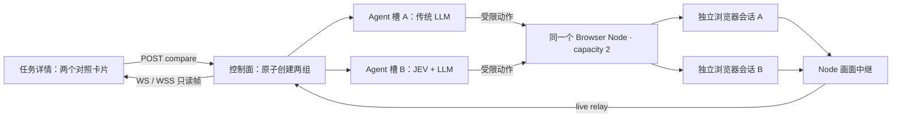

# JEV / LLM 并行对比

## 使用

打开任一任务详情，点击「并行对比 JEV / LLM」。控制面在同一事务中复制两份任务，保留目标、验收标准、环境和预算，刷新创建时间及截止时间；原任务与原报告保留。新详情页同时展示两组：

- 对照组 A：传统 LLM 决定动作、填写内容和验收。
- 实验组 B：真实 TypeSafe JEV 从当前页面候选中选择动作；输入文字和最终验收仍使用同一个 LLM。它是 JEV + LLM 混合策略，不是纯 JEV。

两组有独立执行租约、浏览器会话和报告，可由同一 worker 的不同并发槽执行。重复请求相同 comparisonId 不会重复创建。自动与显式 `environment.auth` 登录槽均支持对比：两组从同轮次的不可变初始快照创建独立会话，一组中途登录不会即时改变另一组。启用登录复用时首组分配确定本轮节点，另一组即使晚于首组结束才领取，也不能换节点。其他独立任务可以更新自动节点偏好；本轮仍保持原节点。节点满载或不可用时排队，路由冲突返回 `COMPARISON_NODE_CONFLICT`；恢复配置可继续，新一轮对照可重新选节点。不要对不可重复的业务写入直接创建对比任务；浏览器隔离不等于目标系统数据隔离。此对比入口属于内部实验功能，不进入公开 [Case API](public-api.md)。

## 启动配置

在现有启动环境 `.proofrun/local.env` 中配置以下项，并按 README 原流程启动数据库、API、Node、Agent、Console。密钥只留在本机忽略文件中，不放入 `VITE_*`。

```sh
export PROOFRUN_AGENT_CONCURRENCY=2
# 100 次动作的混合策略还会调用填写与纠偏模型，独立限制总请求。
export PROOFRUN_AGENT_MAX_TURNS=200
export TYPESAFE_API_KEY='填写自己的 TypeSafe 密钥'
export TYPESAFE_MODEL=jev-latest
# 仍需原有 PROOFRUN_MODEL_BASE_URL、PROOFRUN_MODEL_API_KEY、PROOFRUN_MODEL。
pnpm dev:agent
```

Node 配置 `node.toml` 的顶层 `capacity = 2`，且节点须具备 `liveView` 能力。修改后重启 Node。Agent 槽数允许 1–8，默认 1；实际并行量受可用 Node 容量约束。两组按普通调度领取，不保证在同一毫秒开始，也不保留两个槽等待成组启动。

Console HTTP 开发模式：

```sh
pnpm dev:console
```

Console HTTPS / WSS 开发模式（证书必须包含对应主机并被浏览器信任）：

```sh
export PROOFRUN_TLS_CERT=/absolute/path/localhost.crt
export PROOFRUN_TLS_KEY=/absolute/path/localhost.key
pnpm --filter @proofrun/console exec vite --host 127.0.0.1 --port 5443 --strictPort
```

访问 `https://127.0.0.1:5443` 时自动使用 WSS，访问 HTTP 时使用 WS。生产环境应在同源 HTTPS 反向代理上支持 WebSocket upgrade；Node 与控制面跨主机连接同样应配置 WSS。开发代理的 TLS 入口不代表容器内部链路也使用 TLS。

## 架构与权限



- `POST /v1/tasks/:id/compare`：管理员认证，body 为 `{ "comparisonId": "自定义唯一标识", "maxActions": 100 }`。可选 maxActions 为 1–1000 的整数；省略则沿用原预算，两组使用相同覆盖值，原任务保持不可变。同一 comparisonId 的预算也不可更改。
- `GET /v1/tasks/:id/comparison`：返回同组的两份任务详情。
- `/v1/live/connect`：管理员凭据在 WebSocket 第一条消息认证，不出现在 URL。消息为 `{ "type": "authenticate", "executionId": "执行 ID", "token": "管理员凭据" }`。
- `/v1/live/relay`：现有节点凭据认证，并校验 streamId、节点身份和代次。Node 继续校验 session、lease 和 fence。
- 观看不切换到 HUMAN，不暂停 Agent，不接受鼠标键盘命令。人工接管或执行结束时关闭自动观看通道。
- 同一执行的观看者共享一条 Node 流，慢连接丢帧而不积压队列。状态约 750ms 更新，任务详情约 5 秒刷新。
- 最后一帧仅为内存预览缓存，最多 16 个执行、30 分钟，API 重启后清空。它不作为验收证据；正式证据仍由原有证据链维护。

## JEV 决策边界

JEV 使用任务相关正文、近期动作、预算、错误反馈和有来源的历史；当前正文最多 14,000 字符，最多 200 个动作候选，另有 5 个控制项。整体请求同时检查 64,000 字符与估计 28,000 token 的上限，裁剪明确报告缺口。历史最多保留八个状态，具体组织见 [任务进度设计](general-workflow-optimization.md)。

步骤缺口、目标失效、停滞、低预算、恢复耗尽及 VERIFY / REPLAN 会触发文本审查。有效恢复预算内不因固定轮数额外审查。JEV 的选择和文本回复都经过公共执行器校验，不能从完成倾向直接推导 PASSED。

支持点击、填写、原生选择、页面或指定容器滚动、观察与文本审查。填写由 JEV 选择字段、LLM 生成值；最终验收由 LLM 根据原标准与真实证据完成。供应商上下文超限交给文本审查；其他错误保留其故障语义。所有真实子请求计入预算，token 只记录供应商已返回的用量。

## 测量与测试边界

比较应固定原任务全部要求、初始登录快照、预算和重复次数，同时统计总耗时、供应商请求、浏览器操作、证据覆盖及阻塞/失败。模型建议回放见 [脚本说明](../scripts/README.md)，自动化入口见 [测试说明](../tests/README.md)。单次运行快慢或模型自报 PASSED 均不能证明某种策略整体更优。
